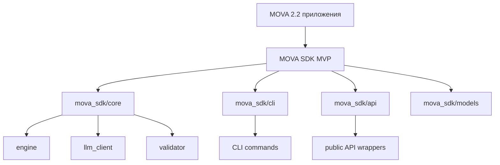

# PLAN_SDK_ARCHITECTURE.md

В этом документе описывается архитектура планируемого MOVA SDK для продакшна с CLI.
Цель: определить MVP API surface, модули, контракты и миграцию.

## MVP API surface
- Инициализация конфигурации
- Запуск задач/скриптов
- Получение результатов
- Логирование
- Обработка ошибок

## Архитектура модулей
- mova_sdk/core
- mova_sdk/cli
- mova_sdk/api
- mova_sdk/models

## core
- engine: orchestration
- llm_client: wrapper вокруг LLM
- validator: валидация входных данных
- state/cache: сессии и кеширование

## cli
- skeleton с базовыми командами: init, run, status, version, config
- интеграция с core через публичный контракт

## api
- обертки над core для удобного использования в приложениях

## models
- общие данные и контракты (DTOs)

## Контракты и типизация
- использовать typing, dataclasses, Protocols
- документировать pubic API с docstrings

## Рейтинг потоков данных
CLI -> API wrappers -> Core engine -> LLM/ML
Core engine -> validator, state/cache
API wrappers -> Core

## Диаграмма Mermaid (overview)

## Миграция и релизы
- Плавный переход: параллельная разработка и миграционные слои
- Верификация через тесты и CI/CD
- План релизов MVP 0.1.0, далее 0.2.0, 0.3.0

## Этапы внедрения
- Этап 0: подготовка PLAN_SDK_ARCHITECTURE.md и PLAN.md
- Этап 1: определить MVP surface и контракт
- Этап 2: создать mova_sdk skeleton
- Этап 3: конфигурация, логирование
- Этап 4: ядро и состояние
- Этап 5: тесты
- Этап 6: CI/CD и упаковка
- Этап 7: документация
- Этап 8: релизы

## Критерии успеха
- чётко задокументирован MVP surface
- работоспособный skeleton mova_sdk
- план миграции и релизов
- диаграммы и контрактная документация

## Примечания
PLAN_SDK_ARCHITECTURE.md должен быть утвержден как часть релиза MVP
PLAN.md должен служить дорогой картой перехода

Ссылка на PLAN.md: PLAN.md
Ссылка на PLAN_SDK_ARCHITECTURE.md: PLAN_SDK_ARCHITECTURE.md