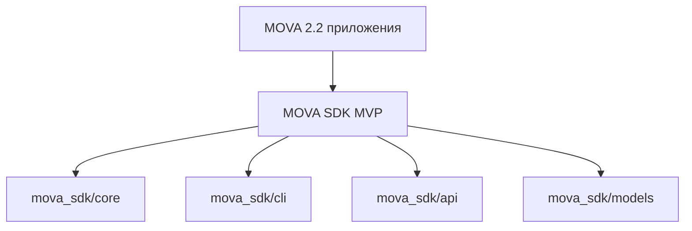

# MOVA SDK Skeleton - Initial Outline

Этот документ предоставляет минимальный blueprint для построения mova_sdk как production-grade SDK с CLI.

- Цели
- Область
- Архитектура целевой SDK
- MVP API surface
- Предлагаемая структура пакета

Mermaid диаграмма overview

```
- MVP API surface
  - Инициализация конфигурации
  - Запуск задач/скриптов
  - Получение результатов
  - Логирование
  - Обработка ошибок

- Предлагаемая структура пакета
  - mova_sdk/core
  - mova_sdk/cli
  - mova_sdk/api
  - mova_sdk/models
  - tests

- Контракты и типизация
  - typing, dataclasses, Protocols
  - docstrings для публичных API

Ссылки на документы
- PLAN.md: [`PLAN.md`](PLAN.md)
- PLAN_SDK_ARCHITECTURE.md: [`PLAN_SDK_ARCHITECTURE.md`](PLAN_SDK_ARCHITECTURE.md)

Пример базового кода skeleton (для будущей реализации)
```python
# sdk skeleton example
# This is a conceptual placeholder file for initial planning.
from typing import Any, Dict

class Engine:
    def __init__(self, config: Dict[str, Any] = None):
        self.config = config or {}

    def run(self, payload: Any) -> Any:
        raise NotImplementedError("Engine.run not implemented in skeleton")

def main():
    print("MOVA SDK skeleton ready. Implement core workflow in follow-up tasks.")