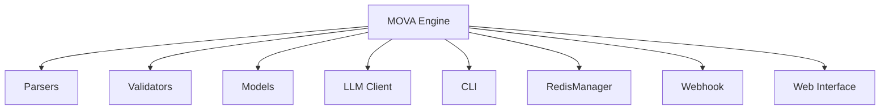

# MOVA Architecture

Это документ, который даёт обзор архитектуры MOVA на высоком уровне и служит ориентиром для дальнейших улучшений.

## Core Components

- MOVA Engine
- Parsers
- Validators
- Models
- CLI
- RedisManager
- LLM Client
- Webhook
- Web Interface

## Architecture Diagram

## Data Flow

Input File -> Parser -> Validator -> Engine -> Output